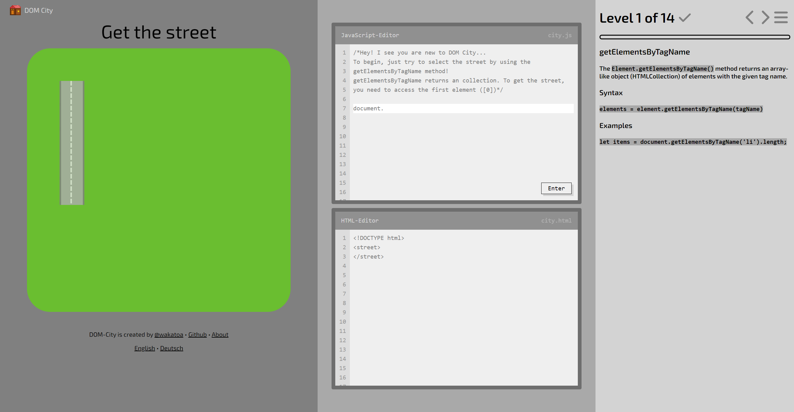

# DOM City - Learning the DOM-API in a playful way

DOM City is a fun game to learn the DOM-API. To play, visit [https://dom-city.github.io/](https://dom-city.github.io/).

It was developed as part of the bachelor thesis "DOM City: Learning the DOM-API in a playful way".

## DOM-API Members supported

-   getElementsByTagName
-   getElementsByClassName
-   getElementsByName
-   getElementById
-   querySelectorAll
-   querySelector
-   textContent
-   getAttribute
-   createElement
-   append
-   remove

## Contributing

Pull requests are welcome!

## Languages

Currently, the following languages are supported:

-   English by [WakaToa](https://github.com/wakatoa)
-   German by [WakaToa](https://github.com/wakatoa)

## Author

-   [GitHub](https://github.com/wakatoa)

## License

DOM City is licensed under the [MIT LICENSE](https://github.com/dom-city/dom-city.github.io/blob/main/LICENSE)
